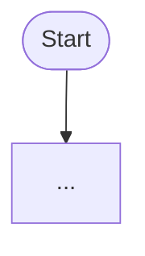

# Reverse-Engineering Specification

**Target:** "Code Repository Explanation Tool" (this repository)
**Goal of this document:** a complete, language-agnostic blueprint recovered by reading the source directly, detailed enough to re-implement the system from scratch in any language/stack with byte-compatible on-disk artifacts and a wire-compatible HTTP API.

This spec describes **what the code actually does**, including bugs and platform quirks, because a faithful clone must reproduce behavior, not the README's claims. Where behavior is an apparent defect, it is flagged **[QUIRK]** with the choice a re-implementer must make.

---

## 1. System overview

A read-only batch analyzer + a browse server.

```
            ┌────────────── BATCH (run.py) ──────────────┐
 source ──▶ load ──▶ parse(AST) ──▶ resolve calls ──▶ build graph ──▶ summarize ──▶ highlights ──▶ RAG index ──▶ report
 (url/path)                                                │            (LLM, cached)   (LLM)        (embeddings)   (md)
                                                           ▼
                                              data/<repo>/{graph,summary,summary_cache,
                                                           highlights,rag,report,...}
            ┌────────────── SERVE (serve.py + viewer.html) ──────────────┐
 browser ◀──▶ FastAPI reads the data/<repo>/ artifacts; adds on-demand LLM endpoints (chat, explain) with their own caches
```

Two executables:

- **`run.py <source>`** — produces all artifacts under `data/<repo_name>/`. Idempotent and resumable (every expensive step is disk-cached and skipped if present).
- **`serve.py <repo_name>`** — HTTP server on `0.0.0.0:8000` that serves the single-page viewer and JSON/streaming APIs over the artifacts.

**Reference stack (not a requirement):** Python 3.10+, stdlib `ast`, LangChain + OpenAI (chat + embeddings), NumPy, FastAPI/uvicorn, NetworkX (imported but largely unused), vis-network/mermaid/highlight.js in the browser. A clone may use any equivalent.

---

## 2. Core data model

### 2.1 Node types
`repo`, `folder`, `file`, `class`, `function`. (Methods are stored as `function` nodes with a `class` field in metadata — there is no separate `method` node type in artifacts, though the server tolerates a `"method"` type in two places.)

### 2.2 Edge types (the `rel` field)
- `contains` — structural hierarchy: repo→folder→file→class→function (and file→function for top-level functions). **This is the spine**: all tree traversal, summarization order, and the tree view follow `contains` edges only.
- `imports` — file→file, when one file imports a module resolvable to another in-repo file.
- `calls` — function→function, statically resolved (best effort).
- `inherits` — class→base class, when the base name matches an in-repo class.

### 2.3 Node ID scheme (critical — must match exactly)
IDs are strings: `"<type>::<part>::<part>..."`. Construction rule:

```
make_node_id(type, *parts):
    sanitized = [ part.replace(" ", "_").replace("/", "_") for part in parts ]
    return "::".join([type] + sanitized)
```

Per-type composition:

| Type | Parts passed | Example ID |
|------|--------------|------------|
| repo | `repo_name` | `repo::deeprag` |
| folder | `folder_path` (relative, the **raw** OS path string) | `folder::src` |
| file | `file_path` (relative POSIX path) | `file::retriever_tools_emb_index.py` (from `retriever_tools/emb_index.py`) |
| class | `file_path, class_name` | `class::utils.py::Foo` |
| function (top-level) | `file_path, func_name` | `function::utils.py::main` |
| function (method) | `file_path, class_name, method_name` | `function::utils.py::Foo::bar` |

Notes:
- Only space and `/` are replaced with `_`. So `/` in paths disappears from the ID while it is preserved in `metadata.path`/`metadata.file`. IDs are **not** reversible to paths.
- **[QUIRK — Windows path separators]** `folder` IDs and the file→folder hierarchy are derived from `str(Path.parent)` / `relative_to(...)` **without** normalizing to POSIX. On Windows the folder path contains backslashes (`scripts\data-construct\filter-stage1`), which are *not* sanitized, and the parent-folder computation splits on `/` — so on Windows nested folders fail to nest and attach directly to the repo node. A clone should **normalize all paths to POSIX (`/`)** before building IDs and folder hierarchy; that is clearly the intended behavior. Document the chosen normalization so artifacts are reproducible.

### 2.4 The graph object (in memory & `graph.json`)
```jsonc
{
  "version": 1,
  "repo_name": "deeprag",
  "created_at": "2026-05-28T22:07:16.272918",   // local ISO-8601, time of build
  "nodes": [ Node, ... ],
  "edges": [ {"source": id, "target": id, "rel": "contains|imports|calls|inherits"}, ... ]
}
```
Node shape (fields present depend on type):
```jsonc
{
  "id": "function::utils.py::Foo::bar",
  "type": "function",
  "name": "bar",
  "qualified_name": "Foo.bar",     // functions/methods only
  "summary": "",                    // ALWAYS "" in graph.json; real summaries live in summary_cache.json
  "metadata": { ... }               // see below, varies by type
}
```
`metadata` by type:
- repo: `{ "root": repo_name }`
- folder: `{ "path": folder_path }`
- file: `{ "path", "module", "language", "docstring" }`
- class: `{ "file", "bases": [str], "docstring", "lineno" }`
- function: `{ "file", "class"?, "args": [{"name","annotation"}], "returns": str|null, "docstring": str|null, "decorators": [str], "lineno" }` (`class` present only for methods)

Edges are de-duplicated on the triple `(source, target, rel)`.

---

## 3. Stage-by-stage algorithms

### 3.1 Configuration (`config.py`)
- Read `env.txt` **in the program directory** (not `.env`). Parser: for each line, strip; ignore blank, lines starting `#`, and lines without `=`. Split on the **first** `=`; `key=key.strip()`, `value=value.strip()`. Apply with set-if-absent semantics — **real environment variables take precedence** over `env.txt`.
- Exposed constants and defaults:
  - `OPENAI_API_KEY` = "" 
  - `LLM_MODEL` = `"gpt-4o-mini"`
  - `LLM_BASE_URL` = ""
  - `EMBEDDING_MODEL` = `"text-embedding-3-small"`
  - `EMBEDDING_BASE_URL` = ""
  - `DATA_DIR` = `<program_dir>/data` — **[QUIRK]** hardcoded; a `DATA_DIR` line in `env.txt` is **ignored** despite docs implying otherwise.
  - `REPO_CLONE_DIR` = `<OS temp dir>/code_tool_repos`

### 3.2 LLM client (`llm_client.py`)
A thin abstraction over an OpenAI-compatible chat + embeddings provider. **[QUIRK]** Despite README prose saying answers come "from Claude", the default provider is **OpenAI** (`gpt-4o-mini`). A clone needs four operations:

- `chat(system, user, model) -> str` — single-shot completion.
- `stream_messages(messages, model) -> iterator<str>` — yields content token deltas; messages are `[{role, content}]` with roles `system|user|assistant`. Empty deltas are skipped.
- `embed(texts, model) -> float32[N, D]` — batch-embed; **L2-normalize each row** (so later cosine similarity is a plain dot product); empty input → shape `(0,0)`.
- Provider selection: if `*_BASE_URL` is set, point the client at that base URL and send API key literal `"EMPTY"` (vLLM/local-server convention); otherwise use the real `OPENAI_API_KEY`.
- Clients are cached/singletons per model.

### 3.3 Repo loading (`repo_loader.py`)
Input: a string `source`.
- **GitHub** if it starts with `https://github.com/` or `git@github.com:`.
  - Parse `owner/repo` from the URL (strip trailing `/` and `.git`).
  - Clone target = `REPO_CLONE_DIR / repo.lower()`.
  - If target exists and not `--force`: reuse it. If exists and `--force`: delete it (recursive) then clone.
  - Clone via `git clone <url> <target>` with a **300s timeout**. Nonzero exit → error with stderr; missing `git` binary → "git not found"; timeout → explicit error.
- **Local** otherwise: resolve to absolute path; must exist and be a directory.
- Returns the repo root path. The repo's `name` (last path segment) becomes `<repo_name>` for the data dir. (For GitHub this is the lowercased repo name; for local it is the directory's actual name, case preserved.)

### 3.4 Parsing (`code_parser.py`) — no LLM
Walk the repo recursively. **Skip** any file whose path contains a component in: `.git, __pycache__, .venv, venv, node_modules, dist, build, .next`. Process only extensions in the language map: `.py→python, .js/.jsx→javascript, .ts/.tsx→typescript`.

**[QUIRK]** Only Python is parsed in practice: JS/TS parsing requires an optional `tree-sitter` dependency that is absent, so those code paths are dead. A clone may target Python only, or implement JS/TS to the same data model.

For each file, produce a `ParsedFile { path (POSIX, relative), language, module_name, docstring, imports[], classes[], functions[] }`.

**Module name derivation** from relative path: split on `/`; if the last segment is `index.py`/`index.js`, drop it; else strip the extension; join non-empty segments that don't start with `.` using `.`. (E.g. `a/b/c.py` → `a.b.c`.)

**Python extraction (via AST), top level only:**
- Module docstring = the file's leading string literal expression, if any.
- Iterate **top-level statements only**:
  - `class` → `ParsedClass { name, file_path=<filename only>, lineno, bases=[unparsed base expr], docstring, methods[] }`. Methods = `def`/`async def` directly in the class body.
  - top-level `def`/`async def` → `ParsedFunction`.
  - `import` / `from ... import ...` → `ImportInfo`.
- **[QUIRK]** Nested functions, methods of nested classes, and conditionally-defined symbols are **not** captured.

`ParsedFunction { name, qualified_name, file_path=<filename only>, lineno, args[], returns, docstring, decorators[], calls[], is_method, class_name }`:
- `qualified_name` = `Class.name` for methods, else `name`.
- `args` = **positional parameters only** (`node.args.args`). Each `{name, annotation}` where annotation is the unparsed type expression or null. **[QUIRK]** `*args`, `**kwargs`, keyword-only, and positional-only params are dropped.
- `returns` = unparsed return annotation or null.
- `decorators` = unparsed decorator expressions.
- `docstring` = function docstring or null.
- `calls` = de-duplicated set of call targets found by walking the whole function body for call expressions: a bare-name call records the identifier (`foo`); an attribute call records the full dotted source (`self.bar`, `module.baz`).

`ImportInfo { module, names[], is_from }`:
- `from M import a, b` → `{module: "M", names: ["a","b"], is_from: true}` (`module` is `""` for `from . import x`).
- `import M` (and `import M, N`) → **[QUIRK]** records only the **first** module: `{module: "M", is_from: false}`. Additional names on the same statement are lost.

**Folder tracking:** for every parsed file, record its parent folder (relative; root → `""`) → set of file paths. Folders with `""` (repo root files) are not stored as folder entries.

### 3.5 Call-graph resolution (`code_parser.py: resolve_call_graph`) — no LLM
Build indices over all parsed symbols:
- `name_to_ids[name] -> [raw_id...]` for every function and method (collisions expected).
- `qualified_to_id[qualified_name] -> raw_id` (e.g. `Foo.bar`).
- `module_to_file[module_name] -> file_path`.

Raw symbol IDs use `::` over the **full relative file path**:
- function: `"<file_path>::<func_name>"`
- method: `"<file_path>::<class_name>::<method_name>"`

For each function/method, resolve each raw call string via **three tiers**, first hit wins, unresolved dropped:
1. **Qualified match:** call string is a key in `qualified_to_id` (e.g. a literal `Foo.bar`).
2. **Same-file name match:** call string is a key in `name_to_ids`; among candidates keep those whose raw id **starts with the caller's file_path**; take the first.
3. **`self.` method match:** only when resolving inside a class and the call string contains `self.`; strip `self.`, form `Class.method`, look up in `qualified_to_id`.

Result: `{ caller_raw_id -> [callee_raw_id, ...] }` (each list de-duplicated; callers with no resolved calls omitted). **[QUIRK]** Tier-2 prefers same-file only — cross-file plain-name calls are not resolved unless they happen to be qualified; this is intentional ("higher confidence").

### 3.6 Graph build (`code_graph.py: build_graph`)
Produce nodes + edges from `ParsedFile`s and the call graph. Order and rules:
1. **Repo node.**
2. **Folder nodes** (iterate folders sorted): name = last path segment (or repo name if empty). `contains` edge from parent folder (computed by dropping the last `/`-segment; if that parent isn't a known folder, attach to repo) → this folder. *(See §2.3 Windows quirk — normalize paths.)*
3. **File nodes** with `contains` from their folder (or repo if at root). Then, within each file:
   - **Class nodes** (`contains` file→class), each with its **method** function-nodes (`contains` class→method).
   - **Top-level function nodes** (`contains` file→function).
4. **Import edges:** for each `ImportInfo`, find the first in-repo file whose `module_name == imp.module` **or** `module_name startswith imp.module + "."`; add `imports` file→file; stop at first match. **[QUIRK]** ambiguous imports resolve to the first match only.
5. **Call edges:** map each raw caller/callee id (split on `::`, ≥3 parts ⇒ method, else top-level function) to a node ID via `make_node_id`; add `calls` edge only if **both** endpoints exist as nodes.
6. **Inherits edges:** for each class base name, search **all** in-repo classes for a matching `name`; add `inherits` class→base. **[QUIRK]** matched by bare name anywhere in the repo; external bases (not defined in-repo) yield no edge; name collisions can mis-link.
7. De-duplicate edges on `(source, target, rel)`.

Persist atomically to `graph.json` (write `*.tmp`, then replace). `node["summary"]` is always `""` here.

### 3.7 Bottom-up summarization (`code_summary.py`) — LLM, cached
The expensive stage; must be **incremental and resumable**.

- Build a children map from `contains` edges. Determine **roots** = nodes with no incoming `contains` edge (normally just the repo node, but the algorithm tolerates multiple).
- **Post-order DFS** from each root: summarize all children before the parent. Skip any node already in the cache (resumability). Mark visited to avoid cycles.
- For each node, build the LLM **user message** depending on type:
  - **function** → field-style block:
    ```
    Function: <name>
    File: <metadata.file or "unknown">
    Inputs: <arg> (<annotation|unknown>), ...    | or "Inputs: (none)"
    Outputs: <returns|unknown>
    Docstring: <docstring>                         | omitted if none
    Decorators: <d1>, <d2>                         | omitted if none
    ```
  - **class/file/folder/repo** → synthesize from children already in cache:
    ```
    <Type capitalized>: <name>

    Child summaries:
      - <child_name>: <first line of child summary, truncated to 80 chars>...
    ```
    (Children pulled via `contains` edges; only cached children contribute.)
- **System prompt** is loaded fresh from `prompts/<node_type>_describe.system.txt` on every call (so prompt edits take effect immediately). **[QUIRK — exact filenames]** the lookup is literally `"{node_type}_describe"`, so the files must be named `function_describe`, `class_describe`, `file_describe`, `folder_describe`, `repo_describe`. If a prompt file is missing, the node's summary becomes the sentinel string `"[Error: no prompt for <type>]"` (the committed `data/deeprag/summary_cache.json` still shows `"[Error: no prompt for function]"` from when the function prompt was misnamed — a clone must ship all five correctly named).
- Call the LLM with `[{system}, {user}]`, accumulate streamed tokens, `strip()`. On exception, store `"[Error: <message>]"` as the summary (do not abort the run).
- **Cache entry** per node: `{ "summary": str, "name": str, "node_type": str }`, keyed by node ID.
- **Write the entire cache to `summary_cache.json` after every node** (atomic tmp→replace). This is what makes interruption safe.
- Optional `on_progress(message)` callback fired before each LLM call (e.g. `"Summarizing function: bar"`).

**Partial re-summarize** (`summarize_node_and_ancestors`): given a node, compute the set {node ∪ all ancestors via `contains`}, then post-order traverse restricted to that set, summarizing children-before-parents. *(Implementation note for clones: the guard meant to keep cached ancestors is a no-op as written (`node_id != node_id`), so in practice every node in the ancestor set that isn't already cached gets summarized; the requested node is re-summarized only if it was uncached. Reproduce or fix per taste — fixing to "force-refresh the requested node, reuse cached ancestors" is the clearer intent.)*

**Summary tree** (`save_tree` → `summary.json`): recursively build from the repo node over `contains` edges:
```jsonc
{
  "repo_name": "<graph.repo_name>",
  "generated_at": "<graph.created_at>",
  "tree": { "id", "type", "name", "summary": "<from cache or ''>", "children": [ ...same shape... ] }
}
```

### 3.8 Highlights (`highlights.py`) — LLM, cached
Per-file key-concept extraction. For each file's full source text:
- Skip if the file path is already in `highlights.json`.
- Call LLM: system = `prompts/code_highlight.system.txt`, user = the raw file source.
- Parse the response as JSON; it **must be a JSON array of strings**. If parsing fails or it isn't a list → `[]`.
- Cache entry: `{ "concepts": [str, ...], "source_length": <len of source> }`, keyed by file path.
- Write `highlights.json` after each file (atomic). The file source map is built by `run.py` reading each parsed file from disk (`utf-8`, errors ignored).

### 3.9 RAG index (`rag.py`) — embeddings
Input: the **enriched** summary cache (each entry must carry `summary`, `node_type`, `name`). `run.py` builds this by joining `summary_cache.json` with node `type`/`name` from the graph, **only for nodes present in the cache**.

- **Chunking** per summary: `strip()`; skip if empty. Fixed window of **2000 chars** with **200-char overlap** (i.e. advance by 1800). Each chunk: `{ node_id, node_type, name, text }`.
- Embed all chunk texts in **batches of 64**; stack into a `float32 [N, D]` matrix (rows already L2-normalized by the embed call).
- Persist: `rag.npz` = compressed array under key `vecs`; `rag.json` = the chunk metadata list (compact JSON, no indentation, same order as rows). If there are zero chunks, write nothing.
- **Query (`topk`)**: embed the query (1×D, normalized); `sims = vecs · q`; optional `node_type` filter (set non-matching sims to −1); take indices of the top-`k` (default 5) by descending sim; return `{...chunk, score}` for those with sim > −1.

### 3.10 Report (`report.py`)
Render `report.md` from the summary tree + highlights:
- `# <repo_name>`, then `*Generated: <generated_at>*`.
- `## Overview` = the repo (tree root) summary.
- `## Architecture` = recursive sections for each child. Heading level = depth+1 `#`s; line format `"<##...> <name> (<type>)"`, then the summary. **Functions are skipped** in the report (folders/files/classes only).
- `## Key Concepts by Module` = for each file (sorted), up to the first 10 concepts as `` - `concept` ``.
- Light markdown escaping of `_`, `[`, `]` in names.
- Write atomically.

### 3.11 Orchestration & CLI (`run.py`)
Args: `source` (positional, required), `--force` (flag), `--steps` (default `all`), `--filter` (default `""`).
- **[QUIRK]** `--filter` is parsed but **never used** — a no-op.

Pipeline with early-exit gates (stderr logging throughout; returns process exit code, nonzero on load failure):
1. `load_repo(source, force)`. Compute `data_dir = DATA_DIR/<repo_name>`; `mkdir`. Write `source_root.txt` = absolute repo path (consumed later by the server for source/explain).
2. `parse_repo`.
3. `resolve_call_graph`.
4. `build_graph` + save `graph.json`.
   - **gate:** if `--steps parse` → stop.
5. `summarize_all` (incremental).
6. `save_tree` → `summary.json`.
   - **gate:** if `--steps summarize` → stop.
7. Read each file's source; `highlight_all` → `highlights.json`.
   - **gate:** if `--steps highlights` → stop.
8. Enrich cache (join with node type/name) and `build_index` → `rag.npz`+`rag.json`.
   - **gate:** if `--steps rag` → stop.
9. Load `summary.json`; `generate_report` → `report.md`. (`--steps all` / `report` run everything.)

---

## 4. On-disk artifact contract (`data/<repo_name>/`)

| File | Writer | Format | Purpose |
|------|--------|--------|---------|
| `graph.json` | run (build) | object, §2.4 | the knowledge graph; the source of truth for structure |
| `summary_cache.json` | run/serve (summarize) | `{ node_id: {summary,name,node_type} }` | flat, incremental summary cache (resumable) |
| `summary.json` | run/serve (save_tree) | object, §3.7 | nested summary tree (derived from cache) |
| `highlights.json` | run (highlights) | `{ file_path: {concepts:[str], source_length:int} }` | per-file key concepts |
| `rag.json` | run (rag) | `[ {node_id,node_type,name,text}, ... ]` | chunk metadata, row-aligned with vectors |
| `rag.npz` | run (rag) | compressed array, key `vecs` = `float32[N,D]` | normalized embedding matrix |
| `report.md` | run (report) | markdown | human-readable architecture report |
| `source_root.txt` | run | one line: absolute repo path | lets the server read original source |
| `explain_cache.json` | serve | `{ node_id: markdown_str }` | cached per-function code-level explanations |

Concrete shapes (from real artifacts):

```jsonc
// graph.json (excerpt)
{ "version": 1, "repo_name": "deeprag", "created_at": "2026-05-28T22:07:16.272918",
  "nodes": [
    {"id":"repo::deeprag","type":"repo","name":"deeprag","summary":"","metadata":{"root":"deeprag"}},
    {"id":"file::retriever_tools_emb_index.py","type":"file","name":"emb_index.py","summary":"",
     "metadata":{"path":"retriever_tools/emb_index.py","module":"retriever_tools.emb_index","language":"python","docstring":null}}
  ],
  "edges": [ {"source":"repo::deeprag","target":"folder::retriever_tools","rel":"contains"} ] }

// summary_cache.json (excerpt)
{ "file::retriever_tools_emb_index.py": {
    "summary":"This module is designed to ...", "name":"emb_index.py", "node_type":"file" } }

// rag.json (excerpt) — one element per chunk, row i ↔ vecs[i]
[ {"node_id":"repo::deeprag","node_type":"repo","name":"deeprag","text":"This codebase implements ..."} ]

// highlights.json (excerpt)
{ "retriever_tools/emb_index.py": {
    "concepts":["split_text","build_index","SentenceTransformer","faiss.IndexFlatIP"], "source_length":3043 } }
```

Atomic-write convention everywhere: serialize to `<name>.tmp`, then atomically replace `<name>`. JSON uses UTF-8, `ensure_ascii=false`; pretty-printed (indent 2) **except** `rag.json` which is compact.

---

## 5. HTTP API contract (`serve.py`)

Server holds **one** loaded repo in a global context. All `/api/*` (except `/api/repos` and `/api/load-repo`) require a repo to be loaded, else **400**. Base URL `http://localhost:8000`.

| Method | Path | Request | Response | Notes |
|--------|------|---------|----------|-------|
| GET | `/` | — | `viewer.html` | the SPA |
| GET | `/api/repos` | — | `{ "repos": [name,...] }` | dirs under `data/` that contain `graph.json`, sorted |
| POST | `/api/load-repo/{name}` | — | `{ "status":"loaded", "repo_name":name }` | loads graph, RAG index, summary cache, highlights, explain cache, resolves source root; 500 on failure |
| GET | `/api/graph` | — | the graph object | |
| GET | `/api/summary` | — | `summary.json` | 404 if absent |
| GET | `/api/node/{id}` | — | node object + `"summary"` (from cache) | 404 if id unknown |
| GET | `/api/highlights` | — | highlights map | |
| GET | `/api/source/{id:path}` | — | `{ "source":str, "lineno":int|null, "file":str }` | needs node `metadata.file`/`path` and a valid source root; 404/503 otherwise |
| GET | `/api/explain/node/{id:path}` | `?refresh=bool` | **stream** `text/plain` markdown | function/method only (else 400); served from `explain_cache.json`, `refresh=true` regenerates |
| GET | `/api/explain/class/{id:path}` | — | **stream** NDJSON | class only; one line per method, then a completion line |
| GET | `/api/report` | — | `{ "report": markdown }` | 404 if absent |
| GET | `/api/mermaid` | — | `{ "mermaid": text }` | file-level import diagram (see below) |
| POST | `/api/summarize` | — | **stream** NDJSON | runs full summarize + save_tree; emits a completion line |
| POST | `/api/summarize/node/{id}` | — | **stream** NDJSON | summarize node+ancestors + save_tree |
| GET | `/api/chat` | `?question=...` | **stream** `text/plain` | RAG-grounded answer |

### 5.1 Streaming formats
- **Token stream** (`text/plain; charset=utf-8`): used by `/api/chat` and `/api/explain/node`. The body is the answer text streamed as it is generated; client renders incrementally.
- **NDJSON** (`application/x-ndjson`): one JSON object per `\n`-terminated line. Client must buffer partial lines.
  - `/api/explain/class`: per method `{ "node_id", "name", "cached": bool, "markdown": str }`, then `{ "status":"complete", "class": name }`.
  - `/api/summarize`: `{ "status":"complete", "nodes_summarized": int }`.
  - `/api/summarize/node/{id}`: `{ "status":"complete", "node_id": id }`.
  - **[QUIRK — dropped progress]** The summarize endpoints define an `on_progress` that `yield`s progress lines, but it is a nested generator that is never iterated, so **no progress lines are actually emitted** — only the final `complete` line is. A clone may either reproduce this (completion-only) or correctly stream progress; the viewer only `console.log`s progress, so behavior is unaffected for the bundled UI.

### 5.2 Chat grounding (`/api/chat`)
1. `topk(question, k=5)` over the RAG index.
2. Build a context block joining each hit as `"[<node_type>:<name>] <text>"` separated by `\n---\n`.
3. Send a fixed prompt: system = `"You are a helpful code documentation assistant."`; user = a template embedding the context and the question and instructing a concise, cited answer. (The `prompts/code_qa.system.txt` file exists for this purpose but the server currently inlines its own system string; a clone can use either, but to match exactly, inline the short system string above.)
4. Stream tokens back as `text/plain`.

### 5.3 Per-function explanation (`/api/explain/node`)
- Only `function`/`method` nodes. Serve from `explain_cache.json` if present (and not `refresh`); else:
  - Extract a **source snippet**: read the node's file (via the source root), take up to **80 lines** starting at `metadata.lineno`.
  - Build user message: `Function:`, `Signature: def name(arg: ann, ...) -> returns`, `Docstring:` (if any), `Decorators:` (if any), then the snippet in a fenced ```python block. System = `prompts/func_explain.system.txt` (fallback to a one-line instruction if missing).
  - Stream tokens; accumulate; on completion persist the full markdown to `explain_cache.json` (atomic).
- `/api/explain/class` simply iterates the class's method children (via `contains`), reusing the same per-node cache, emitting one NDJSON line each (`cached` reflects whether it was a cache hit). 404 if the class has no method children.

### 5.4 Mermaid diagram (`/api/mermaid`)
Generate a `graph TD` flowchart of **file-level import edges**:
- Map each file node to a safe id `F{i}`.
- Group files by **top-level folder**; emit a `subgraph` per folder (root files ungrouped). Node label = file name.
- For each `imports` edge between two mapped files, emit `Fsrc --> Ftgt`.
- If no files: return a single-node placeholder graph.

---

## 6. Frontend behavior contract (`viewer.html`)

Single self-contained HTML page (CDN libs: vis-network, mermaid, highlight.js, plus a small markdown renderer). Three columns. A clone must reproduce **behavior + the API calls**, not the exact styling.

**Bootstrapping:** on load, `GET /api/repos` → fill a dropdown. On selecting a repo: `POST /api/load-repo/{name}`, then fetch `/api/graph` and `/api/summary` (it also fires `/api/highlights` but **[QUIRK]** discards it — only graph+summary are used to render initially), then render the tree and the graph.

**Left column — tree + actions:**
- Tree shows **only** `repo`/`folder`/`file` nodes (from `summary.tree`), recursively, with expand/collapse toggles and type icons (by file extension). Clicking a row selects that node.
- "Summarize All" → confirm → `POST /api/summarize`, drain the NDJSON stream (progress to console), then reload the repo.

**Center column — Graph / Diagram tabs:**
- **Graph** (vis-network): one vertex per node (`label`=name), colored by type — `repo #FFD700`, `folder #4a90e2`, `file #52C41A`, `class #FF7A45`, `function #999999`. Edges colored by rel — `contains #ccc`, `imports #4a90e2`, `calls #FF7A45`, `inherits #9C27B0`. Four checkboxes filter edge types and re-render. Clicking a vertex selects the node. Physics on (Barnes-Hut), auto-fit.
- **Diagram**: `GET /api/mermaid` and render the returned mermaid source.

**Right column — detail pane (tabs) + source + symbols + chat:**
- On select: `GET /api/source/{id}` (render line-numbered source, highlight + scroll to `lineno`), render a **symbols** list (classes/methods/top-level functions for that file, derived from the in-memory graph, sorted by line), and `GET /api/node/{id}` → detail tabs:
  - **Info**: for functions, a signature card + params table + return badge; docstring; location (`file : lineno`).
  - **Summary**: `node.summary` (or a hint to run Summarize All).
  - **Refs**: callers/callees/imports computed from `currentGraph.edges` client-side.
  - **Explain**: for function/method → `GET /api/explain/node/{id}` streamed; render markdown progressively, syntax-highlight code, render mermaid blocks at the end; show a "cached locally" tag + a Regenerate button (`?refresh=true`). For a class → "Explain All" → `GET /api/explain/class/{id}` NDJSON into an accordion (one expandable item per method).
- **Chat**: `GET /api/chat?question=...` streamed into a markdown bubble.

---

## 7. Prompt contracts (verbatim)

The five `*_describe` prompts drive summarization; their **filenames must equal `<node_type>_describe.system.txt`**. `code_highlight` must yield a JSON array. `func_explain` drives `/api/explain/node`. `code_qa` exists for chat (server currently inlines an equivalent). Reproduce these to match output formatting.

**`function_describe.system.txt`**
```
You are a code documentation assistant. Given Python/JS/TS function metadata (name, args with types, return type, docstring, decorators, what it calls), write a tool-description style summary.

OUTPUT FORMAT — fill every field exactly:
Function: <name>
Inputs: <param1> (<type>), <param2> (<type>), ...
Outputs: <return_type>
Purpose: ONE sentence — what this function does from the caller's perspective.
Role: ONE sentence — when/why it is called; its place in the larger system.

RULES:
- If no type annotation: write "unknown"
- Do not describe the implementation; focus on interface and purpose
- Use the docstring as primary source; supplement with call list
- No extra fields or prose outside the template
- Be concise; each line should be readable in one glance
```

**`class_describe.system.txt`**
```
You are a code documentation assistant. You will be given a class name, its base classes, docstring, and method summaries. Write a concise class-level summary.

Output 3-5 sentences in plain English:
1. What is this class responsible for? (its single responsibility)
2. How does it relate to its base classes (if any)?
3. What are its most important methods and what do they collectively achieve?
4. Where is this class used in the larger system (infer from method names and call patterns)?

Use Markdown. Do not add a heading. Do not invent information not present in the method summaries or docstring.
```

**`file_describe.system.txt`**
```
You are a code documentation assistant. You will be given a module name, module docstring, and class/function summaries. Write a concise module-level summary.

Output 3-5 sentences in plain English:
1. What is the overall purpose of this module?
2. What are the key abstractions it provides (key classes/functions)?
3. How does it fit into the broader codebase (infer from what classes/functions define and their summaries)?

Use Markdown. Do not add a heading. Do not invent information not present in the provided summaries.
```

**`folder_describe.system.txt`**
```
You are a code documentation assistant. You will be given a folder/package path and summaries of all modules it contains. Write a concise package-level summary.

Output 2-4 sentences:
1. What is the overall responsibility of this package?
2. How do the modules work together?
3. What is the main entry point or most important module?

Use Markdown. Do not add a heading. Base your answer only on the provided module summaries.
```

**`repo_describe.system.txt`**
```
You are a code documentation assistant. You will be given a repository name and summaries of its top-level packages/folders. Write a repository-level architecture summary.

Output 4-6 sentences:
1. What does this codebase implement? (high-level purpose)
2. What are the main components and their roles?
3. What is the data flow / processing pipeline (if applicable)?
4. What are the key design patterns or architectural choices?

Use Markdown. Do not add a heading. Base your answer only on the provided package summaries.
```

**`code_highlight.system.txt`** (response must be a JSON array of strings)
```
You are a code analysis assistant. You will be shown the source code of one file (Python, JavaScript, or TypeScript). Your job: identify the most important identifiers, patterns, and concepts a developer should understand when reading this file.

RULES:
- Return ONLY a JSON array of strings. No prose, no code fences, no explanation.
- Each item must be: a class name, function name, important constant, design pattern name, or framework component name that appears in this file.
- Prefer names that are defined IN this file (not just imported).
- 5–15 items total. Fewer is fine for small files.
- Do NOT include: generic names ("self", "args", "kwargs", "result", "data"), dunder methods except __init__ if complex, import paths.

Example output:
["DeepRAGModel", "forward", "retrieval_decision", "chain_of_thought_sampling", "RETRIEVAL_THRESHOLD"]
```

**`func_explain.system.txt`** (drives `/api/explain/node`; produces sectioned markdown + a mermaid flowchart)
```
You are a senior engineer explaining code to a colleague. Given a function or method's source code, signature, and context, write a clear, code-level explanation of HOW it works.

OUTPUT FORMAT — use Markdown with bullet points and **bold keywords**:

## How it works

- **[key step or concept]**: short explanation of what happens and why
- **[next step]**: ...
(3–8 bullets covering the main logic flow, in execution order)

## Key concepts
- **[term/pattern]**: one-line definition in context (e.g. **lazy evaluation**, **cache hit**, **recursion base case**)
(2–5 entries — only for non-obvious terms actually used in this function)

## Edge cases & gotchas
- **[condition]**: what happens and why it matters
(1–3 entries — only include if genuinely non-obvious; omit this section if none)

## Flowchart



Show the control flow of the function as a Mermaid flowchart TD diagram:
- One node per major branch, loop, early return, or significant action
- Use shapes: ([Start/End]) for entry/exit, [action] for steps, {condition?} for branches, [(cache/store)] for data stores
- Label edges on branches (Yes/No, or the condition value)
- Keep node labels short (≤ 6 words); use `-->` for flow, `-- label -->` for labelled edges
- Aim for 5–12 nodes; omit trivial straight-line steps that add no insight
- Use valid Mermaid syntax only — no HTML, no parentheses inside node labels unless using the correct shape syntax

RULES:
- Focus on the implementation — the loops, branches, data transformations, and side effects
- Bold every technical keyword, pattern name, data structure, or important variable name on first use
- Use inline code backticks for actual identifiers: `variable_name`, `method()`, `TYPE`
- Keep each bullet to 1–2 sentences; no filler
- Do not repeat the function signature or docstring verbatim
- Do not invent behavior not visible in the source
- Omit any section that has nothing meaningful to say
```

**`code_qa.system.txt`** (chat system prompt; the server currently inlines an equivalent short string)
```
You are a code understanding assistant. You help developers understand a Python/JavaScript/TypeScript codebase by answering questions using the provided knowledge graph summaries, function descriptions, and code context.

Answer the question concisely and accurately. Use Markdown. Cite specific functions or classes when relevant (use the exact names as they appear in the code). If you don't know the answer based on the provided context, say so — do not hallucinate code or facts that weren't provided.
```

---

## 8. Cross-cutting invariants (must hold in a clone)

1. **Idempotent & resumable.** Every LLM/embedding result is keyed and persisted immediately; re-running skips cached work. Deleting one artifact regenerates exactly that stage.
2. **Atomic writes.** All JSON/markdown artifacts are written via temp-file-then-replace.
3. **Prompt files are data.** They are read fresh on every call; editing a prompt changes output with no code change. Their names are part of the contract (§3.7).
4. **`contains` is the only hierarchy.** Summaries, the tree, the report, and explain-class all traverse `contains` exclusively.
5. **Embeddings are pre-normalized** so retrieval similarity is a dot product.
6. **Node IDs are opaque keys**, derived but not reversible; never parse paths back out of an ID except the coarse `split("::")` the call-edge mapper and the viewer breadcrumb use.
7. **Graph `summary` field is vestigial** (always `""`); the live summaries are in `summary_cache.json` and surfaced via `/api/node`.

---

## 9. Defect ledger (decide reproduce vs. fix per item)

| # | Location | Behavior | Suggested clone choice |
|---|----------|----------|------------------------|
| 1 | node IDs / folders | Windows `\` not normalized; folder nesting splits on `/` → broken nesting & IDs on Windows | **Fix:** normalize to POSIX before ID/hierarchy |
| 2 | parser imports | `import a, b` keeps only `a` | **Fix:** record all names |
| 3 | parser args | only positional params captured (no `*args/**kwargs/kwonly`) | Fix if signatures matter |
| 4 | parser scope | nested funcs / nested-class methods ignored | Document; fix if needed |
| 5 | call resolution | tier-2 same-file only; cross-file plain calls unresolved | Intentional; keep |
| 6 | import edges | first module match wins (ambiguous) | Keep or disambiguate |
| 7 | inherits | base matched by bare name anywhere | Keep; risk of mis-link |
| 8 | config | `DATA_DIR` env ignored (hardcoded) | Fix: honor env |
| 9 | run CLI | `--filter` is a no-op | Implement or remove |
| 10 | serve summarize | progress lines never emitted (dropped generator) | Fix streaming if progress UI wanted |
| 11 | viewer load | `/api/highlights` fetched then discarded | Harmless; wire it up |
| 12 | summarize_node_and_ancestors | dead guard `node_id != node_id` | Fix to intended cache-reuse |
| 13 | docs vs code | README says "Claude"; default is OpenAI `gpt-4o-mini`; prompt names in docs (`func_describe`) are wrong | Use code as truth |

---

## 10. Minimal build order for a re-implementation

1. Config loader + LLM/embeddings client abstraction (§3.1–3.2).
2. Repo loader (local + git clone) (§3.3).
3. AST parser → `ParsedFile` model (§3.4) and call resolver (§3.5).
4. Graph builder + `graph.json` (§3.6, §2) — get node IDs and `contains` exactly right first; everything else depends on them.
5. Summarizer with incremental cache + tree (§3.7) and the five `*_describe` prompts.
6. Highlights (§3.8), RAG index (§3.9), report (§3.10).
7. CLI orchestrator with `--steps`/`--force` gates (§3.11).
8. HTTP server with the §5 endpoints (start with read-only ones; add streaming chat/explain last).
9. Viewer reproducing the §6 behaviors against the same API.

Validate by pointing the clone at the same input repos and diffing `graph.json` structure (node/edge counts and IDs) and `rag.json`/`summary.json` shapes against the originals.
```
